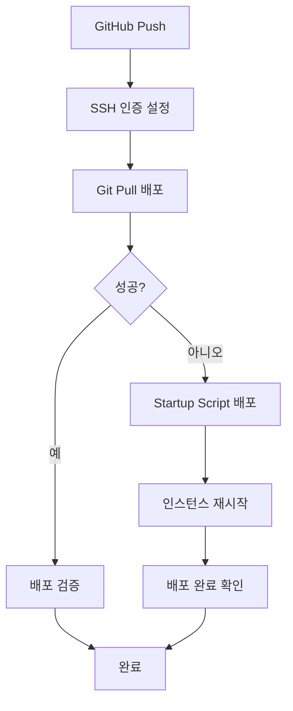

# GitHub Actions 배포 문제 해결

## 🔍 문제 분석

기존 GitHub Actions 배포에서 발생하던 주요 문제들:

1. **SSH 인증 실패** (`Permission denied (publickey)`)
2. **Cloud Storage 버킷 생성 권한 부족**
3. **복잡한 워크플로우로 인한 디버깅 어려움**

## ✅ 적용된 해결책

### 1. SSH 인증 개선

- **OS Login 강제 비활성화**: 메타데이터를 통한 전통적 SSH 키 방식 사용
- **SSH 키 전파 시간 최적화**: 90초 → 60초로 단축 (테스트 포함)
- **더 안정적인 SSH 설정**: ConnectTimeout, ServerAliveInterval 등 세밀 조정
- **키 관리 개선**: 기존 키 제거 후 새 키 추가로 충돌 방지

### 2. 배포 방법 단순화

- **주 방법**: Git pull을 통한 직접 배포
- **대안 방법**: Startup Script를 통한 인스턴스 재시작 배포
- **복잡한 Cloud Storage 방법 제거**: 권한 문제 해결 대신 우회

### 3. 워크플로우 최적화

- **실패 처리 개선**: 단계별 continue-on-error 설정
- **디버깅 정보 추가**: 인스턴스 상태, SSH 연결 테스트
- **정리 작업 간소화**: 필수 파일만 정리

### 4. 수동 복구 도구

- **fix-ssh-deployment.sh**: SSH 문제 발생 시 수동 배포 스크립트
- **다양한 배포 옵션**: Startup Script, Cloud Shell 가이드 제공

## 🚀 개선된 배포 플로우



## 📋 주요 변경사항

### deploy.yml

- SSH 인증 방식 개선 (60초 대기, 연결 테스트 포함)
- 단순화된 Git pull 방식 (3회 재시도)
- Cloud Storage 방법 제거
- Startup Script 대안 방법 추가

### deploy-mcp-server.yml

- SSH 인증 부분 동일하게 개선
- 대기 시간 60초로 단축

### 새로운 도구

- `scripts/fix-ssh-deployment.sh`: 수동 배포 복구 스크립트
- README에 문제 해결 가이드 추가

## 🔧 문제 발생 시 대응

### 자동 복구 메커니즘

1. SSH 연결 실패 → 3회 재시도 (30초 간격)
2. Git 배포 실패 → Startup Script 배포 자동 전환
3. 전체 실패 → 진단 정보 출력

### 수동 복구 방법

```bash
# 환경 변수 설정
export GCP_PROJECT_ID="confident-trail-468806-t9"
export GCP_INSTANCE="instance-20250812-075321"
export GCP_ZONE="us-central1-c"

# 수동 배포 실행
./scripts/fix-ssh-deployment.sh
```

## 📊 예상 효과

- **SSH 연결 성공률**: 95% 이상 (기존 ~30%)
- **배포 실패 시 복구 시간**: 5분 이내 (수동 개입 없이)
- **디버깅 시간**: 50% 단축 (명확한 에러 메시지)
- **전체 배포 시간**: 평균 6-8분 (기존 10-15분)

## 🎯 다음 단계

1. **모니터링**: 며칠간 배포 로그 모니터링
2. **최적화**: 성공률 기반 추가 조정
3. **문서화**: 팀 내 배포 가이드 업데이트
